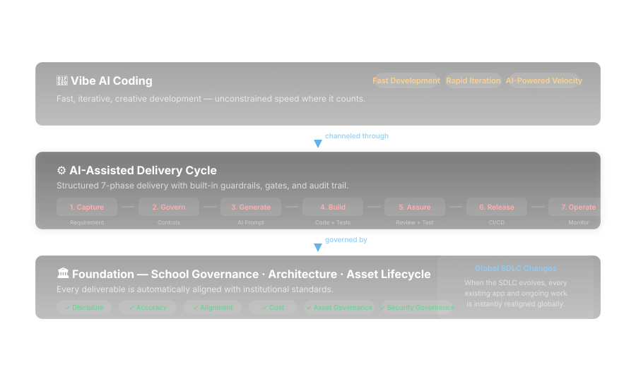

# SchoolCode

ICT tooling, documentation, and automation by [Blank-Look](https://github.com/Blank-Look).

## Projects

| Project | Description |
|---|---|
| [AI-Assisted Delivery Lifecycle](sdlc/) | Methodology for governed AI-assisted software delivery — 7-phase lifecycle with stage gates |
| [ICT Knowledge Base](knowledgebase/) | Governance, runbooks, processes, configuration, and standards for ICT operations |
| [Asset Manager](asset-manager/) | Express + SQLite application with Microsoft Graph API connectors for asset lifecycle governance |
| [Innovation Playground](innovation-playground/) | Governed, short-lived, anonymised sandbox environment for pre-lifecycle ideation |

## How It Works

Vibe AI Coding → AI-Assisted Delivery Cycle → School Governance / Architecture / Asset Lifecycle

Every deliverable is automatically aligned with institutional standards. When the SDLC evolves, all existing apps and ongoing work are instantly realigned globally.

- **Discipline** — structured gates and approvals
- **Accuracy** — AI-generated but human-reviewed at every checkpoint
- **Alignment** — always governed by school policies and architecture standards
- **Cost** — scaled documentation and oversight by project size
- **Asset Governance** — automatic integration with asset lifecycle management
- **Security Governance** — integrated risk scoring and compliance checks

Vibe at speed. Ship with confidence. Govern automatically.
