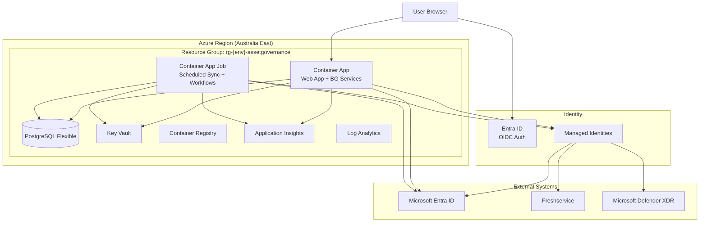
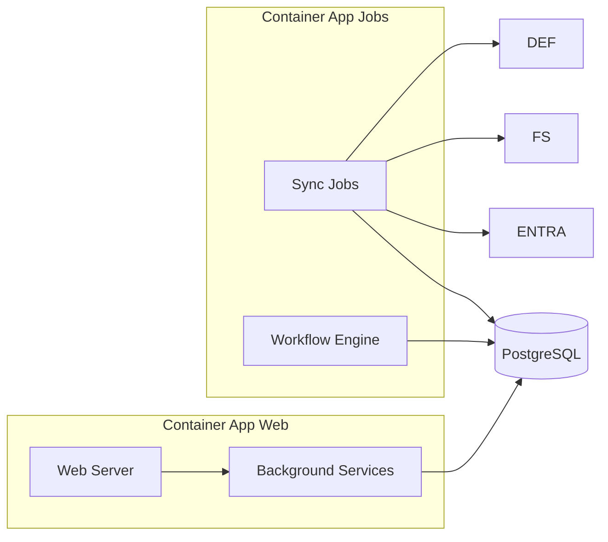

# Architecture — ICT Asset Governance Manager

## Overview

Modular monolith hosted in Azure Container Apps with PostgreSQL, Entra ID authentication, and read-only external integrations.

## Architecture Diagram



## Container Apps Architecture



## Key Decisions

| Decision | Choice | Rationale |
|---|---|---|
| Application pattern | Modular monolith | Avoids microservices complexity for single-team internal app |
| Hosting | Azure Container Apps | Serverless containers, managed identity, no Kubernetes |
| Database | PostgreSQL Flexible Server | Single relational store, EF Core support, managed backups |
| UI framework | ASP.NET Core server-rendered | Blazor or Razor — no SPA frontend for MVP |
| Authentication | Entra ID OIDC | Single-tenant, app roles, no local passwords |
| Integrations | Read-only for MVP | Least privilege, source systems remain authoritative |
| Risk engine | Deterministic rules | Explainable scoring, no opaque AI |
| Workflows | Internal state machine | No external workflow platform needed for MVP |
| Reporting | Built-in + CSV export | No Power BI or analytics platform for MVP |
| Infrastructure | Bicep | Idempotent, environment-parameterised |

## Azure Component Summary

| Component | Purpose | SKU |
|---|---|---|
| Container App | Web application + background services | Consumption |
| Container App Job | Scheduled sync + workflow processing | Consumption |
| PostgreSQL Flexible | Operational database | Burstable (B2ms dev, B4ms prod) |
| Key Vault | Secrets, connection strings | Standard |
| Container Registry | Container image storage | Basic |
| Application Insights | Observability | Per-GB |
| Log Analytics | Log aggregation | Per-GB |

## Resource Naming Convention

```
rg-{env}-assetgovernance          # Resource group
ca-{env}-assetgovernance          # Container app
caj-{env}-sync                    # Sync job
caj-{env}-workflows               # Workflow job
psql-{env}-assetgovernance        # PostgreSQL
kv-{env}-assetgovernance          # Key Vault
acr{env}assetgovernance           # Container Registry
appi-{env}-assetgovernance        # Application Insights
log-{env}-assetgovernance         # Log Analytics
```

Where `{env}` is `d` (development) or `p` (production).
