# Data Model — ICT Asset Governance Manager

## Entity Relationship Diagram

```mermaid
erDiagram
    Asset {
        guid Id PK
        string CanonicalName
        string Description
        string AssetType
        string LifecycleStage
        string OperationalStatus
        string Criticality
        string BusinessImpact
        string ConfidentialityClassification
        string IntegrityRequirement
        string AvailabilityRequirement
        boolean IsPrivacyData
        boolean IsRegulatedData
        string RecordsCategory
        string HostingModel
        string Region
        string BusinessUnit
        string SupportTier
        string BusinessHours
        int RecoveryTimeObjective
        int RecoveryPointObjective
        decimal EstimatedAnnualCost
        decimal ActualAnnualCost
        string Currency
        date ContractRenewalDate
        date EndOfSupportDate
        date EndOfLifeDate
        date LastReviewDate
        date NextReviewDate
        date OnboardingDate
        date RetirementTargetDate
        string SourceAuthority
        datetime SourceFreshness
        string GovernanceStatus
        int RiskScore
        string RiskBand
        datetime CreatedAt
        datetime UpdatedAt
        datetime ArchivedAt
    }

    ExternalSourceRecord {
        guid Id PK
        string SourceSystem
        string ExternalObjectType
        string ExternalId
        string LocalEntityType
        guid LocalEntityId FK
        string SourceUrl
        string SourceVersion
        datetime SourceModifiedAt
        datetime FirstObservedAt
        datetime LastObservedAt
        datetime LastSynchronisedAt
        string RecordHash
        string State
        datetime MissingSince
        string SyncMetadata
    }

    AssetRelationship {
        guid Id PK
        guid SourceAssetId FK
        guid TargetAssetId FK
        string RelationshipType
        string Direction
        string Criticality
        string EvidenceSource
        date EffectiveDate
        date ExpiryDate
        string ReviewStatus
    }

    GovernanceRole {
        guid Id PK
        string Name
        string Description
        string Category
    }

    RoleAssignment {
        guid Id PK
        guid GovernanceRoleId FK
        guid AssetId FK
        string Scope
        guid EntraGroupId
        guid CurrentUserId
        date EffectiveDate
        date ExpiryDate
        string AssignmentSource
        boolean IsDelegation
        boolean IsVacant
        date LastReviewDate
    }

    DataClassification {
        guid Id PK
        string Name
        string Description
        int Rank
        string HandlingRequirements
        int ReviewFrequencyDays
        boolean RequiresEncryption
        string ExternalSharingRule
        string RetentionRequirement
        boolean RequiresPrivacyReview
        string MandatoryControls
    }

    Control {
        guid Id PK
        string Name
        string Description
        string Category
        boolean IsAutomated
        string ApplicableAssetTypes
        string ApplicableLifecycleStages
        string ApplicableCriticality
        string ApplicableClassifications
        boolean RequiresPrivacyData
        string ApplicableHostingModels
    }

    ControlAssessment {
        guid Id PK
        guid ControlId FK
        guid AssetId FK
        string Status
        string Result
        string Evidence
        string EvidenceSource
        string AssessedBy
        datetime AssessedAt
        datetime ExpiresAt
        datetime NextDueAt
        string Comments
        guid ExceptionId FK
        boolean IsAutomated
    }

    RiskFinding {
        guid Id PK
        string Title
        string Description
        guid AssetId FK
        string Category
        string Severity
        int Likelihood
        int Impact
        int ScoreContribution
        string RuleId
        string Evidence
        string EvidenceSource
        datetime FirstDetected
        datetime LastDetected
        date DueDate
        string OwnerRole
        string Status
        string RecommendedAction
        string RelatedAlertId
        guid ExceptionId FK
        string ResolutionEvidence
    }

    WorkflowDefinition {
        guid Id PK
        string Name
        string Description
        string TriggerEvent
        string ApplicableAssetTypes
        string ApplicableLifecycleStages
        string ApplicableCriticality
        string ApplicableClassifications
        string Configuration
        boolean IsEnabled
    }

    WorkflowInstance {
        guid Id PK
        guid DefinitionId FK
        guid AssetId FK
        string Status
        datetime CreatedAt
        datetime CompletedAt
        string Outcome
    }

    WorkflowTask {
        guid Id PK
        guid InstanceId FK
        string TaskType
        guid OwningRoleId FK
        guid CurrentAssigneeId
        string Status
        date DueDate
        date EscalationDate
        string CompletionCriteria
        string ApprovalOutcome
        string Evidence
        string Comment
        string CompletedBy
        datetime CompletedAt
    }

    Exception {
        guid Id PK
        guid AssetId FK
        guid ControlId FK
        guid RiskFindingId FK
        string ControlGap
        string RiskDescription
        string BusinessJustification
        string CompensatingControls
        string AccountableRole
        string ApproverRole
        datetime RequestedAt
        date EffectiveDate
        date ExpiryDate
        string Status
        string ReviewSchedule
        string ClosureOutcome
    }

    Evidence {
        guid Id PK
        string EvidenceType
        string Value
        string Source
        string Description
        guid AssetId FK
        guid WorkflowTaskId FK
        datetime CreatedAt
        string CreatedBy
    }

    AuditEvent {
        guid Id PK
        datetime Timestamp
        string Actor
        string ActorRole
        string Action
        string EntityType
        string EntityId
        string BeforeValue
        string AfterValue
        string Reason
        string CorrelationId
        guid WorkflowId
        guid ExceptionId
    }
```

## Key Relationships

- Asset 1---* ExternalSourceRecord
- Asset 1---* AssetRelationship (source)
- Asset 1---* AssetRelationship (target)
- Asset 1---* RoleAssignment
- Asset 1---* ControlAssessment
- Asset 1---* RiskFinding
- Asset 1---* WorkflowInstance
- Asset 1---* Exception
- Asset 1---* Evidence
- GovernanceRole 1---* RoleAssignment
- Control 1---* ControlAssessment
- WorkflowDefinition 1---* WorkflowInstance
- WorkflowInstance 1---* WorkflowTask
- Exception 1---* ControlAssessment
- Exception 1---* RiskFinding

## Design Decisions

- All IDs are GUIDs for distributed generation and migration safety
- Timestamps stored in UTC
- Currency stored with ISO code
- `Metadata` as JSONB for extensible per-type fields
- Soft deletes via ArchivedAt rather than hard row removal
- Audit events are append-only; no update or delete
