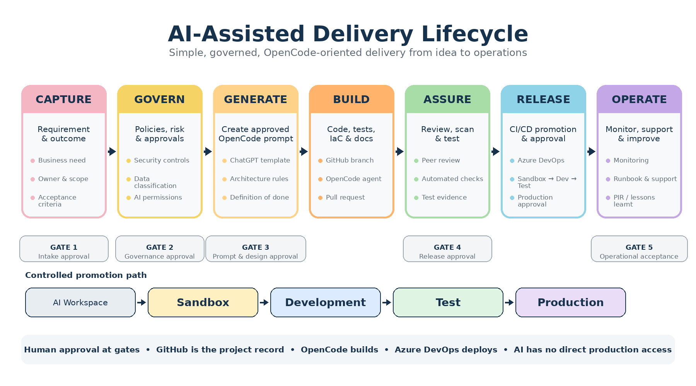

Infrastructure & Security is committed to delivering technology initiatives safely, efficiently and transparently. Artificial intelligence and coding agents can significantly reduce the time required to analyse requirements, create documentation, develop code and automate deployment. They do not remove the need for accountability, security, testing or human approval.

The AI-Assisted Delivery Lifecycle provides a consistent method for delivering projects of different sizes while avoiding unnecessary administration. It combines lightweight requirements capture, automated document and code generation, repository-based evidence, stage-gate governance and controlled CI/CD deployment.

The lifecycle is based on seven activities:

**Capture, Govern, Generate, Build, Assure, Release and Operate.**

*Note: These are **Delivery Lifecycle Stages** — they describe the process of building and releasing technology. They are distinct from the **Operational Asset Lifecycle** (Procurement → Deployment → Operation → Maintenance → Disposal) defined in the [ICT Knowledge Base](../../../../knowledgebase/docs/data-and-protection/asset-lifecycle-policy.html), which governs assets once in service.*

Requirements and applicable governance references are first captured in a structured format. ChatGPT is then used to generate a controlled implementation prompt for OpenCode. OpenCode develops the code, tests, infrastructure and documentation within an approved GitHub repository. Azure DevOps validates and promotes the resulting artefacts through sandbox, development, test and production environments.

Human owners remain accountable for requirements, risk acceptance, design approval, code review, production release and operational acceptance. AI-generated work is treated in the same way as work produced by any other contributor: it must be traceable, reviewed, tested and approved before release.

The amount of documentation and oversight is scaled according to project size and risk. Small, low-risk initiatives may combine gates and use brief repository-based records. Medium and large initiatives require greater architecture, security, testing and leadership oversight. High-risk projects must receive stronger governance regardless of their financial cost or delivery effort.

## The Lifecycle

OpenCode fits this model as the implementation agent. It is an open-source AI coding agent that can operate through a terminal, desktop application or IDE extension.
